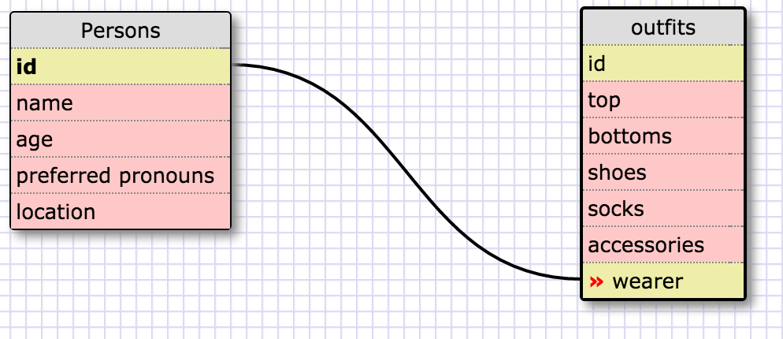

1. Select all data for all states `SELECT * FROM states;`

2. Select all data for all regions. `SELECT * FROM region;`

3. Select the state_name and population for all states. `SELECT state_name, population FROM states;`

4. Select the state_name and population for all states ordered by population. The state with the highest population should be at the top. `select state_name, population from states order by population desc;`

5. Select the state_name for the states in region 7. `select state_name from states where region_id=7;`

6. Select the state_name and population_density for states with a population density over 50 ordered from least to most dense. ` select state_name, population_density from states where population_density > 50 order by population_density ASC;`

7. Select the state_name for states with a population between 1 million and 1.5 million people. `select state_name from states where population between 1000000 and 1500000;`

8. Select the state_name and region_id for states ordered by region in ascending order. `select state_name, region_id from states order by region_id ASC;`

9. Select the region_name for the regions with "Central" in the name. `select region_name from regions where region_name like '%central%';`

10. Select the region_name and the state_name for all states and regions in ascending order by region_id. Refer to the region by name. (This will involve joining the tables). 'select regions.region_name, states.state_name from states inner join regions on states.region_id = regions.id order by states.region_id ASC;

###What are databases for?

Databases are ways to store large amounts of data, particularly if it is data that has more than two categories to keep track of. Arrays are great for single data sets. Hashes are good for storing data in pairs. Databases are good for anything larger than that. They help to store and easily manipulate data.

###What is a one-to-many relationship?
A one-to-many relationship is one where an object in one table is related to many other objects in a different table. This can be accessed by keys.

###What is a primary key? What is a foreign key? How can you determine which is which?
A primary key is an identifier, like an ID number, that is unique to each individual object and helps you navigate a database. A foreign key is a primary key in a different table that you can use to refer to an object in a different table.

###How can you select information out of a SQL database? What are some general guidelines for that?

In the terminal, you can select data using the select keyword. You need to be able to know where you are calling from, like a table name. You also must end the command with a ;
